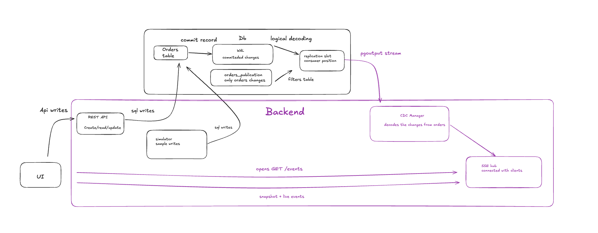
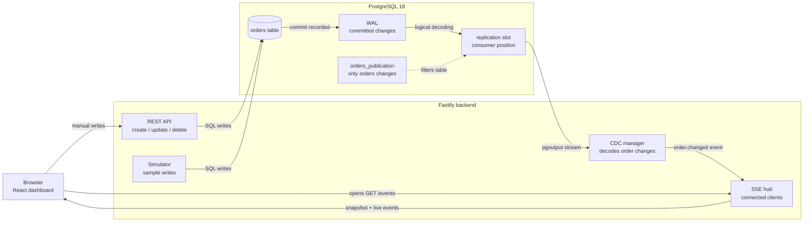

# Real-Time Orders Dashboard (PostgreSQL CDC + Fastify + React SSE)

This repository contains a real-time orders dashboard built with PostgreSQL logical replication, Fastify, SSE, and React.

The app lets users create, update, delete, and simulate order activity. Database changes are captured from PostgreSQL WAL and pushed to the browser over Server-Sent Events.

---

## 1. Architecture Diagram

The diagram below shows the runtime flow from a database write to a browser update:





A simple way to read the diagram:

1. **Write path:** the browser or simulator writes through Fastify REST endpoints into the `orders` table.
2. **Update path:** PostgreSQL records the commit in WAL, logical replication exposes `orders_publication` through the slot, the backend CDC manager converts the database change into an app event, and the SSE hub pushes it to the browser.

---

## 2. How It Works

The system has three main parts: writes, change capture, and browser updates.

### Write Path
1. **User or simulator action:** When a user fills out the "Quick Create" form, or when the simulator runs, an HTTP request is made to the backend.
2. **REST endpoints:** Fastify processes the request inside `backend/src/routes/orders.js` or `backend/src/routes/simulator.js`.
3. **Database write:** The backend runs a normal SQL query (`INSERT`, `UPDATE`, or `DELETE`) against PostgreSQL.

### Change Capture
1. **WAL:** PostgreSQL is configured with `wal_level = logical`. Every committed transaction is written to the WAL first.
2. **Publication:** `orders_publication` tells PostgreSQL that this consumer only wants changes from the `orders` table.
3. **Replication slot:** `orders_dashboard_slot` tracks how far the CDC consumer has read, using an LSN (Log Sequence Number). That lets the backend resume from the right place after a restart, as long as the slot and retained WAL still exist.
4. **CDC consumer:** `OrdersCdcManager` in `backend/src/cdc.js` connects with `pg-logical-replication`, subscribes with the `pgoutput` plugin, and reads the changes exposed by `orders_publication`.
5. **Normalization:** The manager turns `insert`, `update`, and `delete` changes into app-level JSON events.

### Browser Updates
1. **Open `/events`:** When the dashboard opens, the browser creates a long-lived `EventSource` connection to `GET /events`.
2. **Send snapshot:** The backend registers that connection in `SseHub`, sends a `connected` event, and then sends the current `orders` snapshot.
3. **Push changes:** When the CDC manager receives a database change, it sends an `order.changed` event through the SSE hub to connected browsers.
4. **Update React state:** The frontend receives the event, updates rows by `order.id`, and re-renders the cards, charts, and table.

---

## 3. Directory Structure

```text
├── db/
│   ├── init/
│   │   └── 001-init.sql          # DB initialization (Roles, Tables, publications, seed data)
│   └── postgres/
│       ├── pg_hba.conf           # Postgres connection and replication access rules
│       └── postgresql.conf       # Postgres settings (wal_level = logical, max_wal_senders, etc.)
├── backend/
│   ├── src/
│   │   ├── app.js                # Fastify app configuration, plugins, & hooks registration
│   │   ├── server.js             # Entrypoint to start the backend Fastify server
│   │   ├── config.js             # Configuration variables (DB ports, replication slots, etc.)
│   │   ├── db.js                 # PostgreSQL Pool connection manager
│   │   ├── cdc.js                # CDC client subscribing to Postgres logical replication slots
│   │   ├── sse.js                # SSE client registry for broadcasting changes
│   │   ├── simulator.js          # Generates sample order inserts/progress/deletes
│   │   └── routes/
│   │       ├── orders.js         # REST endpoints for manual CRUD on orders
│   │       ├── events.js         # SSE stream endpoint (/events) and snapshot delivery
│   │       ├── health.js         # Health checks (DB status, CDC metrics, active SSE clients)
│   │       └── simulator.js      # REST routes to start/stop the automatic simulator
│   ├── scripts/
│   │   └── seed-orders.js        # Script to pre-populate DB with historical orders
│   └── package.json
├── frontend/
│   ├── src/
│   │   ├── main.jsx              # React app entry point
│   │   ├── App.jsx               # Dashboard UI (KPI cards, Recharts, quick create, simulator controls)
│   │   ├── styles.css            # Tailwind CSS theme, shadcn/ui tokens, and small utilities
│   │   ├── components/           # shadcn/ui components (cards, badges, tables, selects, inputs)
│   │   └── lib/                  # Utility functions (Tailwind class-merger)
│   ├── vite.config.js
│   └── package.json
├── docker-compose.yml            # Orchestrates the isolated PostgreSQL 18 container
└── package.json                  # Root monorepo workspace configurations
```

---

## 4. Setup & How to Run

Follow these steps to run the project locally.

### Prerequisites
- **Docker** and **Docker Compose** installed.
- **Node.js (v18+)** and **npm** installed.

### Step 1: Install Dependencies
From the root of the workspace, run the following to install all monorepo dependencies:
```bash
npm install
```

### Step 2: Start the Database
Launch the preconfigured PostgreSQL 18 container. This database mounts the logical replication config automatically:
```bash
docker compose up -d
```
You can verify the database health by running `docker compose ps`.

### Step 3: Run Database Seeds (Optional but Recommended)
Populate the database with historical data to populate the charts and trend line on the dashboard:
```bash
npm run seed:orders
```

### Step 4: Start the Services

Start the backend and frontend in two terminal sessions:

#### Run the Backend Fastify Server:
```bash
npm run dev:backend
```
*The backend will boot up at `http://127.0.0.1:3000`.*

#### Run the Frontend React Application:
```bash
npm run dev:frontend
```
*Vite will compile and serve the dashboard (usually at `http://localhost:5173`).*

---

## 5. Architectural Trade-offs & Design Choices

### Why logical replication (CDC) instead of standard polling or app-level hooks?
- **Decoupled writes:** The write path does not need to know who is watching for changes. If an external service or SQL script modifies an order directly in the database, the update is still captured and sent to connected browsers.
- **Efficiency:** Polling wastes database connections, CPU cycles, and network bandwidth. Logical replication streams changes pushed by Postgres as they occur.
- **Fewer reads:** One CDC consumer reads changes and the backend fans them out to connected browsers, instead of every browser repeatedly querying the database.

### Why Server-Sent Events (SSE) instead of WebSockets?
- **Directionality:** The browser only needs server-to-client updates, so SSE fits better than a bidirectional WebSocket connection.
- **Simplicity:** SSE uses normal HTTP and the browser has built-in reconnection support through `EventSource`.
- **Lower setup cost:** There is no WebSocket upgrade step or custom ping/pong handling for this use case.

### Failure Modes & Resiliency Considerations
- **Logical Slot Retention:** Stalled replication slots can prevent Postgres from purging old WAL files, risking disk exhaustion. The CDC manager uses auto-acknowledgement and monitors LSN states.
- **At-Least-Once Delivery:** Logical replication is designed for at-least-once delivery. If the backend restarts, it may replay events from the last acknowledged LSN slot. The frontend code is built **idempotently** (updating rows based on unique IDs), ensuring duplicates do not corrupt the UI state.
- **SSE Client Reconnection:** If a browser tab disconnects, Fastify cleans up the client to prevent memory leaks. On reconnection, the backend can replay missed events from its small in-memory SSE buffer when `Last-Event-ID` is still within the buffered range; otherwise the fresh snapshot restores correctness.

---

## 6. If This Were Extended For Production

This version keeps the CDC reader, REST API, simulator, and SSE broadcaster inside one backend service. That keeps the project easy to run, but a production version should split those responsibilities.

The production shape would look closer to this:

```text
PostgreSQL WAL / logical replication
  -> CDC worker
  -> durable event broker
  -> SSE gateway
  -> browser clients
```

For a production version, the main changes would be:

- **Separate the CDC worker:** run the WAL/logical-replication consumer as its own service instead of inside the API server.
- **Add a durable broker:** publish normalized order events to Kafka, Redis Streams, RabbitMQ, or NATS JetStream before sending them to browsers.
- **Scale the SSE layer separately:** run multiple SSE gateway instances that consume from the broker and handle browser connections.
- **Add authentication and authorization:** protect REST endpoints, simulator controls, and `/events`; only send users the order data they are allowed to see.
- **Add pagination and limits:** avoid returning every order from `GET /orders` and from the initial SSE snapshot.
- **Monitor replication health:** track replication slot lag, retained WAL size, CDC restart count, event latency, SSE connection count, and reconnect rate.
- **Improve replay behavior:** use the broker for durable replay instead of relying only on the current in-memory SSE buffer.
- **Handle schema changes carefully:** version the emitted event payloads so database migrations do not break consumers.
- **Add rate limiting:** protect write endpoints, simulator endpoints, and long-lived SSE connections.

A production version would keep CDC as the source of database changes, but add a broker and separate services for durability, retries, replay, and horizontal scaling.
